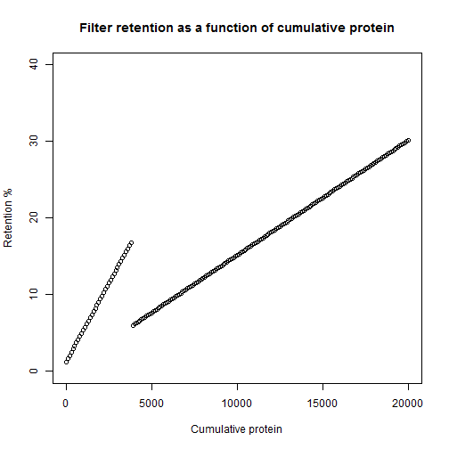

Protein filter optimization
========================================================
author: Dave Latshaw II
date: 1/29/2015

Business Case
========================================================

This tool is to be used for the optimization of a filtration system
used in perfusion based mAB bioprocesses. A % retention greater than
40% indicates a failure of the system so the filter must be changed
out. Using the tool allows the user to adjust the retention profiles
and the time for change out to minimize the total amount of protein
retained by the filter.

This tool will allow for:

- More precise scheduling of a filter change
- More product capture
- Minimized failure risk

Optimization tool
========================================================




Optimal configuration that minimizes the total amound of protein retention and avoids retention limit.  

Total retention
========================================================

To calculate the total amount of protein retained by the filter we use the trapezoidal
method to estimate the integral of the discontinuous curve.  

The total amount of protein retained per amount of protein passing through the filter during a full run in the optimal configuration is:

```
[1] 326487.1
```

Resources
========================================================

The tool itself is located at: https://davathin.shinyapps.io/data_products/

The Github repository is located at: https://github.com/davathin/data_products

Thank you!
